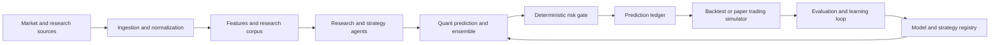

# FinAgent

FinAgent is an open, agent-assisted financial research, backtesting, and paper-trading platform. It records every recommendation, the evidence and model versions behind it, simulated outcomes, and subsequent evaluation so strategy improvement is reproducible rather than implicit.

> **Scope boundary:** FinAgent is research and simulation software. It does not place orders, offer investment advice, or guarantee returns. Any future live-trading integration requires a separately approved safety, legal, and operational design.

## Architecture freeze

The architecture is frozen at the **logical-service** level for the first public build. Start as a modular monolith with clear contracts, then extract services only when operational load, team boundaries, or independent scaling justify it. Python is the primary implementation language; Kafka is introduced when event volume and replay needs merit it.

Key documents:

- [System architecture](docs/architecture/system-architecture.md)
- [Service catalogue](docs/architecture/service-catalogue.md)
- [Data and storage architecture](docs/architecture/data-storage.md)
- [Event contracts](docs/architecture/event-topics.md)
- [AI and evaluation architecture](docs/architecture/ai-evaluation.md)
- [API boundaries](docs/architecture/api-boundaries.md)
- [Implementation roadmap](docs/roadmap/implementation-roadmap.md)
- [Architecture decisions](docs/adr/)

The editable Excel catalogue is [FinAgent service catalogue.xlsx](outputs/finagent-architecture-freeze/FinAgent%20service%20catalogue.xlsx).

## Product flow



## Repository layout

```text
docs/          Architecture, ADRs, roadmap, runbooks
contracts/     OpenAPI, AsyncAPI, JSON Schema, event definitions
services/      Future independently deployable services
libs/          Shared domain libraries and SDKs
ml/            Feature, training, evaluation, and registry assets
notebooks/     Reproducible research only; no production logic
infra/         Infrastructure-as-code, environments, observability
deploy/        Local compose and future deployment manifests
tests/         Contract, integration, replay, and acceptance tests
outputs/       Editable planning artifacts
```

## First build target

The first two weeks produce a local, reproducible vertical slice: daily equities ingestion, normalized prices, one baseline strategy, a prediction-ledger record, a simple backtest, and evaluation metrics. No autonomous trading or live brokerage account access.

## Public-development standards

- Version schemas, strategies, datasets, feature definitions, prompts, and models.
- Keep secrets, account data, API keys, and proprietary datasets out of Git.
- Make each decision replayable from immutable inputs and pinned versions.
- Use pull requests, ADRs, tests, and experiment reports as the public engineering record.

## Status

Architecture and delivery plan frozen on 2026-09-12. Application code intentionally has not started.
