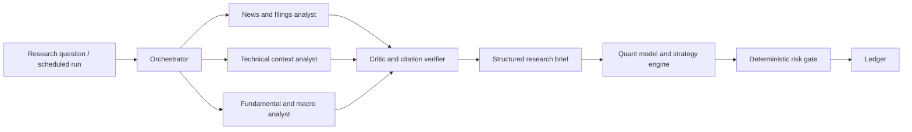

# FinAgent AI Agent and Evaluation Architecture

## Agent roles

Agents return typed, citation-bearing structured data. They cannot call trading, registry-promotion, or unrestricted database tools. Tool allow-lists, budgets, timeouts, prompt-injection filtering, and trace capture are mandatory.

## Quantitative decision boundary

Numeric prediction and expected-risk estimation use feature-based statistical/ML models. The agent layer may suggest research hypotheses, rank evidence, identify missing context, and explain results. It may not replace the risk gate or directly issue an execution command.

## Evaluation and continuous learning

1. Join mature ledger entries to realized market and simulator outcomes by horizon.
2. Compute return, hit rate, calibration, drawdown, turnover, exposure, costs, slippage sensitivity, and regime slices.
3. Detect feature/data drift and agent quality failures (uncited claims, invalid schema, tool errors).
4. Train or tune candidates only on time-split data; retain benchmark baselines.
5. Run walk-forward backtests and paper shadow runs with predeclared acceptance criteria.
6. Require offline evaluation and human approval before registry promotion.
7. Roll back by registry pointer, preserving all evaluation evidence.

Promotion is a governance workflow, never an agent self-action.
