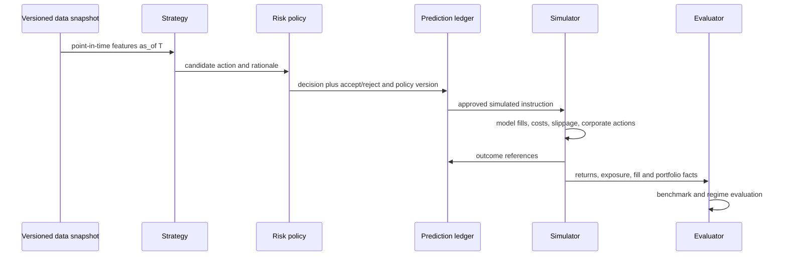

# Backtesting Paper Trading and Copy Trading Simulation

Backtests take an immutable dataset snapshot, code/strategy version, parameter set, calendar, starting capital, universe, fee model, slippage model, delay assumptions, and corporate-action policy. Results are invalid if any are missing.

Paper trading uses current market data and the same strategy/risk/ledger path. Copy trading means a shadow account follows another *simulated* account subject to its own risk limits; it does not copy brokerage accounts or transmit orders.
