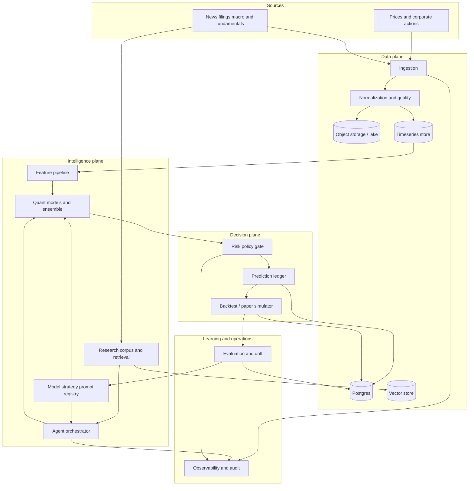

# FinAgent System Architecture

## Decision

FinAgent is a research-first, event-driven platform with an immutable decision record. The first release is a modular monolith with separately testable modules and versioned contracts. Later deployments may extract the listed logical services without changing domain boundaries.

## Design principles

1. Quantitative models produce numerical forecasts; LLMs synthesize evidence, plan research, and explain outcomes.
2. Deterministic controls own eligibility, position sizing, portfolio limits, and paper-order acceptance.
3. Every output is attributable to source snapshots, feature data, prompts, model versions, strategy code, and policy versions.
4. Raw inputs are immutable. Derived data is reproducible and may be recomputed.
5. Backtests use time-aware data access and transaction-cost/slippage assumptions. No future data may reach a past decision.
6. Paper trading is simulated only. It is distinct from copy-trading simulation and never sends broker orders.
7. Learning proposes a candidate; offline gates approve or reject promotion.
8. Schema, event, model, prompt, and policy evolution are explicitly versioned.

## Logical architecture

## Deployment evolution

| Phase | Runtime shape | Why |
|---|---|---|
| 0-2 | Local Docker Compose, modular monolith | Fast learning and low operational load |
| 3-4 | Worker processes plus Kafka-compatible event bus | Replayable ingestion, backtests, and evaluation |
| 5+ | Extract independently scaled logical services | Scale, reliability, and contributor ownership |

No service may bypass the ledger or risk gate. The user interface reads projected state; it does not construct financial decisions.
